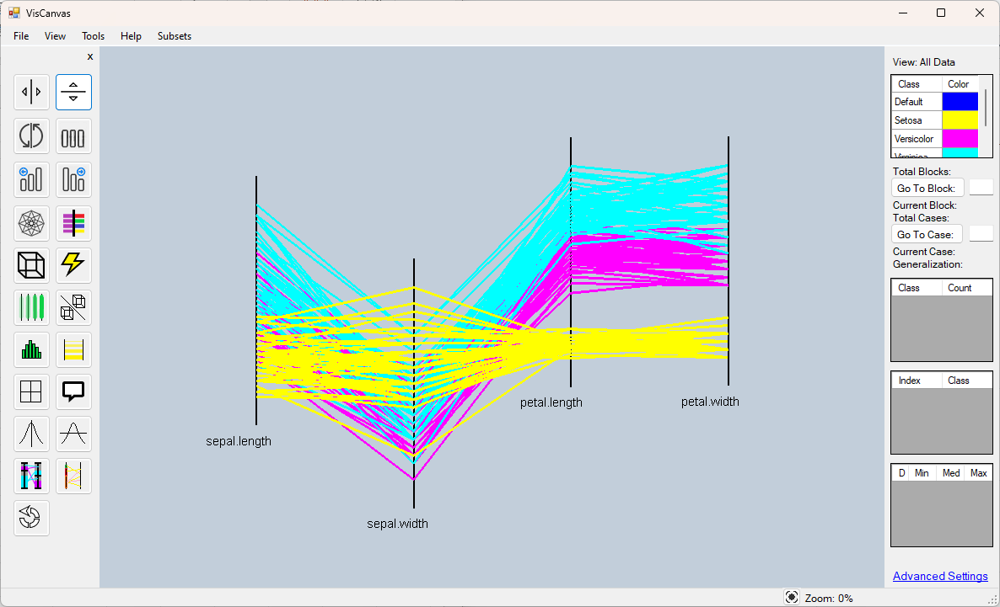

# VisCanvas2.0

Visualization software for multidimensional (n-D) data plotting and analysis.

## Data Format

The data format is a CSV file with the following structure:

| id | x1 | x2 | x3 | x4 | class |
| --- | --- | --- | --- | --- | --- |
| 1 | 5.1 | 3.5 | 1.4 | 0.2 | Setosa |
| 2 | 4.9 | 3 | 1.4 | 0.2 | Setosa |
| 3 | 4.7 | 3.2 | 1.3 | 0.2 | Setosa |
| 51 | 7 | 3.2 | 4.7 | 1.4 | Versicolor |
| 52 | 6.4 | 3.2 | 4.5 | 1.5 | Versicolor |

## License

This software is licensed under the MIT License - see the [LICENSE](LICENSE) file for details.
